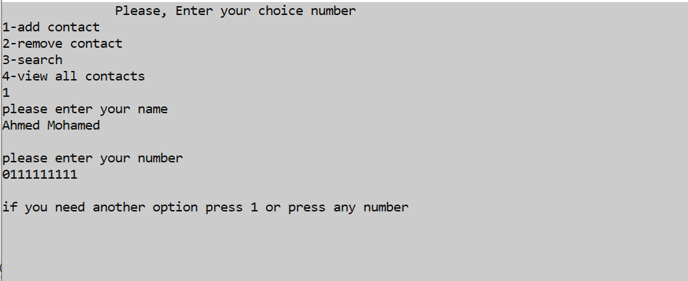
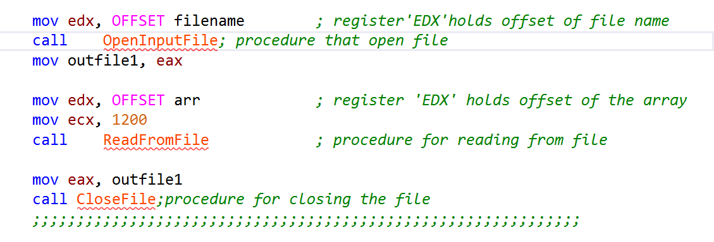

# phone book app in assembly language
---
## team members
- Ahmed Mohamed Hasaneen
- Ahmed Mohamed Abdullah
- Ahmed Magdy Abdelrahman
- Ahmed Ashraf Qasem
- Mario George Shafik
---
## Project idea 
the application allow you to perform simple phone book operations 
- you can do th following operations
    - Add new contact
    - Remove existing contact
    - Search existing contact
    - View all contacts
---
## implementation
For creating this project we depend on **Irvine32** library ( Irvine32 library is collection of helpful functions) 
- it make the tasks related to *input/output* easy
- simplify operations on strings
-  API provided by Irvine32 functions is often simpler to use than similar API provided by OS services
## details 
 ## Main menu
when you run the program the main menu appear asking you to chose needed operation 

when user choose any number the program executes the function related to.

---
## Add contact
allow user to enter the name (*max 12 character*)
 & allow enter number(*max 12 number*)

name and number of each contact stored in array at the right place

---
## Remove contact
when user choose 2 to remove contact then the user prompted to type the name he want to delete 
if the name exist, then it will be deleted from the contacts list (*delete is done*)

if the target name doesn't match any of the contacts (*return not found*)

---
## search contact
when user enter 3 to search, program prompted to type the *name* then the program searches all the contacts for that name , if name is found in the contacts , then that name and all related numbers will be displayed

if name not in contacts, (name is not found) message displayed

---
## View all contacts
when user enter 4 to view all the contacts, then all contacts (name,number) displayed separated by line

---
## Dealing with files
because to we need to store the data permenantly, so we use file to contain data in non volatile memory (*disk*), so at every time user add contact we write the whole array in the file(contacts.txt)

at every time user launch the app, then the whole stored data in file loaded to array buffer in memory

